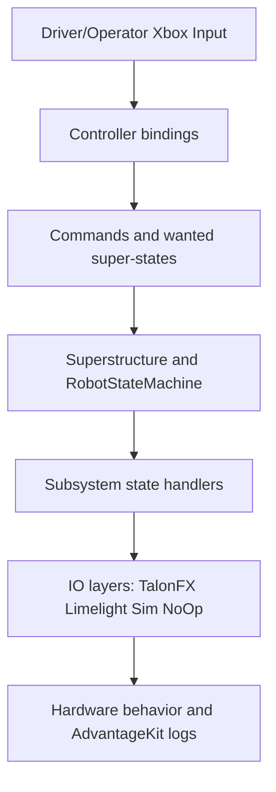

# FRC Team 10079 - 2026 Competition Robot Code

[](https://adoptium.net/)
[](https://github.com/wpilibsuite/allwpilib)
[](https://github.com/FRCTeam10079/FRCRebuilt2026-COMP/actions/workflows/format.yaml)


Competition code for FRC Team 10079 (Arrowdynamics) during the 2026 season, built around a state-machine-first WPILib architecture with Superstructure and RobotStateMachine at the core, plus CTRE swerve, Limelight vision fusion, and logged telemetry.

> [!IMPORTANT]
> This repository is the archived 2026 competition codebase.

## Table of Contents
- [Overview](#overview)
- [Repository Status](#repository-status)
- [Quick Start](#quick-start)
- [Robot Capabilities](#robot-capabilities)
- [Software Architecture](#software-architecture)
- [Key Features](#key-features)
- [Controller Bindings](#controller-bindings)
- [Autonomous Assets](#autonomous-assets)
- [Contributors](#contributors)
- [2026 Season Results and Notes](#2026-season-results-and-notes)
- [Acknowledgements](#acknowledgements)
- [License](#license)

## Overview
This codebase targets the 2026 FRC season and is internally labeled throughout the project as the **FRC 2026 REBUILT** robot software stack. The robot software is structured around a state-machine-first WPILib model with centralized coordination through `Superstructure` and `RobotStateMachine`.

The mechanism and control stack in this archive supports:
- CTRE Phoenix 6 swerve drive
- Shooter flywheel plus tracked shooter pivot
- Indexer/feed path
- Intake wheels plus intake pivot
- Climber extension/retraction workflow
- Dual-Limelight vision-based pose observations

## Quick Start
### Prerequisites
- JDK 17
- WPILib 2026 toolchain

### Build / Check / Test / Simulate
Windows (PowerShell/CMD):

```bash
.\gradlew.bat build
.\gradlew.bat spotlessCheck
.\gradlew.bat test
.\gradlew.bat simulateJava
```

macOS/Linux:

```bash
./gradlew build
./gradlew spotlessCheck
./gradlew test
./gradlew simulateJava
```

### Deploy to RoboRIO
```bash
.\gradlew.bat deploy
```

### AdvantageKit Replay Watch
```bash
.\gradlew.bat replayWatch
```

## Robot Capabilities
| Area | Implementation Summary |
|---|---|
| Drivetrain | CTRE swerve with field-centric teleop, heading lock modes, alignment helpers, and pathfind wrappers. |
| Shooting | Distance and motion compensated setpoints through interpolation + launch calculation, with SmartShoot gating and force-shoot override paths. |
| Superstructure | Central wanted/current state coordinator for mechanism intent translation and interlock handling. |
| Vision | Limelight MegaTag observation ingestion, filtering/rejection, and covariance scaling before drivetrain fusion. |
| Autonomous | PathPlanner chooser-first auto flow, plus retained Choreo trajectory command compositions and marker bindings. |
| Logging | AdvantageKit logger setup for REAL/SIM/REPLAY and high-frequency subsystem/state telemetry output. |

## Software Architecture
The project follows a state-machine-centered WPILib design:
- `Robot` owns lifecycle transitions and scheduler execution.
- `RobotContainer` wires subsystems, controllers, auto command registration, and vision/pathfinding setup.
- Commands express operator/autonomous intent.
- `Superstructure` translates intent into mechanism-level wanted states.
- `RobotStateMachine` tracks global match/game/hub/climb context and feedback.

### Package Map
| Package / File Area | Purpose |
|---|---|
| `subsystems/` | Hardware abstraction + mechanism logic. Includes `drive`, `shooter`, `indexer`, `intake`, `climber`, `vision`, and `Superstructure.java`. |
| `statemachine/` | High-level robot lifecycle and strategy states (`MatchState`, `GameState`, `HubShiftState`, `ClimbState`, etc.). |
| `commands/` | Driver-triggered and helper commands (alignment, SOTM drive, heading/aim helpers). |
| `auto/` | Autonomous command factories, marker binding registration, and chooser integration. |
| `pathfinding/` | Dynamic pathfinding framework with local AD* implementation and command wrappers. |
| `util/` | Project utilities, primarily tunable-number infrastructure for runtime adjustment. |
| `constants/` | Tuned values, IDs, field geometry, tolerances, and behavior parameters. |
| `controllers/` | Driver/operator/testing controller bindings and control orchestration. |
| `lib/` | Shared math/control/logging helpers (launch math, interpolation, hub shift, dashboard publishers, networked tuning wrappers). |
| `generated/` | CTRE Tuner X generated swerve constants/config (`TunerConstants.java`). |

### Data Flow (Runtime)


## Key Features
### 1) Superstructure Mechanism Coordination
`Superstructure` is the primary mechanism coordinator with explicit `WantedSuperState` and `CurrentSuperState` enums. Controls and autos set intent only, and `periodic()` maps intent to concrete mechanism outputs every cycle. It also handles transition-sensitive behavior like SOTM feed hold timing and intake overlay behavior that can run alongside primary scoring states.

### 2) SOTM and SOTF-Style Shot Compensation
The project implements shot compensation through `LaunchCalculator`, `ShooterMath`, and interpolation tables, with drivetrain-side SOTM control and superstructure-side gating. Both scoring-zone and passing/ferrying SOTM branches exist in driver bindings. The calculation pipeline uses robot pose, velocity, and heading context to derive feed-forward and setpoint behavior consistent with moving-shot operation.

### 3) SmartShoot + Hub-Shift Timing Gate
`SmartShootController` coordinates feed timing around hub-shift state from `HubShiftTracker`, and superstructure logic uses it to gate when indexer feed is allowed. This reduces shots taken during disallowed timing windows while preserving operator intent. Telemetry for SmartShoot state and time-to-fire is published through logger and dashboard topics.

### 4) Limelight Pose Estimation and Fusion
Vision uses per-camera IO (`VisionIOLimelight`) and a fusion layer (`Vision`) that evaluates pose observations, rejects invalid data, and computes observation covariance based on distance/tag count/type. Accepted observations are forwarded to the drivetrain vision consumer. The implementation logs accepted/rejected observations and tag metrics for post-match analysis.

### 5) AdvantageKit Logging and Replay Modes
`Robot` configures AdvantageKit differently by mode: WPILOG + NT4 on real hardware, NT4 in sim, and replay source/writer for REPLAY mode. State machine, superstructure, SOTM, and subsystem diagnostics are heavily logged. This gives a strong post-run debugging workflow through AdvantageScope-compatible logs.

### 6) Autonomous Stack: PathPlanner + Choreo + Dynamic Pathfinding
PathPlanner is the active chooser path via `AutoBuilder.buildAutoChooser()`, with named command registration through `AutoCommands`. Choreo trajectory command compositions and marker bindings are also present for reusable command sequencing. Dynamic pathfinding support is provided by a local AD* (`LocalADStar`) implementation that loads `navgrid.json` and computes in a background thread.

### 7) Heading Lock and AprilTag Alignment
Drive control includes heading lock behaviors and AprilTag alignment commands (`AlignToAprilTag`). Driver controls use heading lock during aim workflows, while testing bindings expose additional heading/alignment test combinations. This keeps scoring alignment integrated with normal teleop movement rather than isolated single-shot commands.

## Controller Bindings
<details>
<summary><strong>Driver Controller (Port 0)</strong></summary>

| Control | Action | Notes |
|---|---|---|
| Left stick | Translation drive | Default smooth teleop field-centric drive. |
| Right stick X | Rotation drive | Default teleop rotation command input. |
| Left Trigger (hold) | Intake overlay on/off | Sets independent intake active while held. |
| Right Bumper (hold) | AIM state + heading lock to hub | Superstructure to `AIM`; drivetrain heading lock command in parallel. |
| Right Trigger (hold) | FORCE_SHOOT state | Force-feed shoot path while held. |
| Left Bumper (hold) | SOTM mode | Latches SOTM branch (scoring-zone or passing) and runs corresponding SOTM drive command. |
| A (hold) | AprilTag align center | Runs `AlignToAprilTag(..., CENTER)`. |
| B (press) | Toggle translation invert | Flips left stick translation sign. |
| D-pad Left (press) | Increase TOF at nearest bucket | `ShooterInterpolationTable.adjustTof(..., true)`. |
| D-pad Right (press) | Decrease TOF at nearest bucket | `ShooterInterpolationTable.adjustTof(..., false)`. |
| D-pad Up (press) | Print current TOF bucket | Read-only tuning print helper. |
| D-pad Down (press) | Stow intake | Calls `superstructure.stowIntake()`. |
| X (hold) | UNJAM state + swerve brake request | Reverse path through superstructure and x-stance brake lock while held. |

</details>

<details>
<summary><strong>Operator Controller (Port 1)</strong></summary>

| Control | Action | Notes |
|---|---|---|
| B (hold) | UNJAM state | Reverse feeder/indexer path through superstructure. |
| Left Trigger (hold) | Intake reverse | Runs intake-out command directly. |
| Left Bumper (hold) | Shooter pivot manual override | Enables pivot override and maps left stick Y to manual pivot command. |
| X (press) | Shooter pivot homing | Override on -> home -> override off sequence. |
| D-pad Up/Down | Pivot angle offset +/- | Fine angle offset tuning steps. |
| D-pad Left/Right | RPM offset +/- | Fine flywheel RPM offset tuning steps. |
| A (press) | Confirm insert tuning point | Inserts corrected RPM/angle into interpolation tables and resets offsets. |
| Right Trigger (hold) | FORCE_SHOOT state | Operator force-feed override via superstructure. |
| Start + Back (press together) | Enter climb + extend climber | Climb init combo with anti-release guard logic. |
| Y (press) | Retract climber (conditional) | Runs when climb mode active and climber extended. |
| Right Bumper (press, conditional) | Retract climber to zero | Allowed in climb mode when combo-release guard permits. |
| Back (press, conditional) | Abort climb -> idle | Aborts climber and returns superstructure to `IDLE`. |

</details>

<details>
<summary><strong>Testing Controller (Port 2, disabled when FMS attached)</strong></summary>

| Control | Action |
|---|---|
| A/B/X/Y (hold) | Shooter SysId quasistatic/dynamic forward/reverse |
| Left/Right Bumper (hold) | AprilTag align left/right |
| Start (press) | Reset field heading |
| D-pad Up (hold) | Pathfind test to AprilTag 18 |
| D-pad Down / Right (press) | Pivot stow / deploy jog |
| Right Trigger (hold, no Back) | Feed indexer |
| Left Trigger (hold, no Back) | Slow drive mode while held |
| Back + X (hold) | Heading lock to 0 deg |
| Back + Right Trigger (hold) | Heading lock to visible AprilTag |
| Back + Left Trigger (hold) | Shooter spin-up test + ready rumble |

</details>

## Autonomous Assets
Primary autonomous selection is PathPlanner-based through the SmartDashboard chooser (`Auto Mode`).

<details>
<summary><strong>PathPlanner Autos in Deploy</strong></summary>

- `ClimbAuton.auto`
- `Left_Neutral_Double Trench.auto`
- `Left_Neutral_Trench_Bump.auto`
- `Middle FrontDepot.auto`
- `Niche auto.auto`
- `Right_Neutral_Double Trench.auto`
- `Right_Neutral_Trench_Bump.auto`
- `Right_Op.auto`

</details>

## Contributors
| Contributor | GitHub | Role / Contributions |
|---|---|---|
| Risith | [@risithcha](https://github.com/risithcha) | **Software Lead & Core Architect**: Wrote the entire initial codebase from scratch. Designed and implemented the full `Superstructure` state machine and `RobotStateMachine`. Rebuilt the Limelight/MT1 vision-pose pipeline multiple times, fixing a 180° flip bug and timestamp corruption issue. Migrated the team to AdvantageKit + AdvantageScope for data-driven post-match analysis. Co-developed SOTM math and re-integrated the full working implementation after iterating on logs. Tuned heading lock PID from collected field data. Fixed autonomous command leak (PR #41), idle behavior bug, and power consumption issues. Applied all PNW Districts competition hotfixes. Maintained CI/CD formatter and was the final reviewer/merger of every PR. |
| Nethul | [@Thatcoder321](https://github.com/Thatcoder321) | **Shooting Systems**: Original implementor of Shoot-on-the-Fly (SOTF); Risith assisted with the math. Co-authored the SOTM improvement branch (PR #37), contributing the revised targeting logic adapted to the Superstructure architecture. Added anti-shake deadband logic to stop the robot vibrating in place. Co-authored the trench detection system to automatically lower the pivot on entry and raise it on exit (PR #16). Implemented the initial automatic angle/RPM calculation based on distance to hub. |
| Oliver/Team | [@ArrowDynamics10079](https://github.com/ArrowDynamics10079) | **Hardware Bring-Up & Tuning**: Got the shooter pivot working on physical hardware, unblocking the shooting pipeline. Built tuning bindings for ToF threshold, pivot angle, and flywheel RPM. Updated constants and keybinds across multiple practice-field sessions. Authored the early autonomous command scaffold (pre-movement stage) that Kiet built paths on top of. Co-authored shooter math testing and value adjustments with Nethul, and co-authored the trench pivot auto logic (PR #16). |
| Aaryan | [@Acer-15](https://github.com/Acer-15) | **Bug Fixes & Hardware-Software Interface**: Added dual-motor intake roller support for the updated mechanical design (PR #20). Fixed excessive pivot slack via PID tightening (PR #27). Resolved a subsystem use conflict causing command scheduling collisions (PR #28). Added logic to prevent the indexer from running during intake to stop note jams (PR #29). Patched autonomous consistency timing issues (PR #30). Changed drive motor idle mode from brake to coast. Cleaned up the leftover `PrintStuff` debug command (PR #21). |
| Kiet | [@Kit807](https://github.com/Kit807) | **Autonomous Paths**: Primary author of the team's competition autonomous routines. Created and iterated left/right depot autos, left trench bump and double trench paths, right-side autos, and a dedicated DCMP right-side path. Contributed auto path work across PRs #8, #17, and #38. |
| Innaias | [@sockeye-d](https://github.com/sockeye-d) | **Code Quality**: Cleaned up the pivot subsystem and migrated it to WPILib type-safe units, eliminating a class of unit-mismatch bugs (rotations vs. degrees vs. radians) at the subsystem interface. Applied the same units-first cleanup to the shooter subsystem. |
| Seth | [@sethmortenson64](https://github.com/sethmortenson64) | **Trench Logic Contributor**: Co-authored PR #16 (`Shotpivlowauto`), which introduced the trench detection system; specifically contributed the units handling fix and cleanup for how the pivot angle was being continuously set during trench traversal. |
| Dhruv | [@Duve3](https://github.com/Duve3) | **Early Contributor**: Authored the initial autonomous code skeleton during early robot bring-up. Wheels were not yet moving at that stage, but the structure helped establish the auto command pattern that later contributors built on. |

## 2026 Season Results and Notes
This archive corresponds to Team 10079 competition code used through PNW FRC 2026 events.

### Verified Results Snapshot (2026)
| Event | Rank | Record | Awards / Outcome |
|---|---:|---:|---|
| PNW District Glacier Peak Event | 2 | 15-5-0 | District Event Finalist, Rising All-Star Award; Alliance 2 Captain |
| PNW District Auburn Event | 9 | 8-7-0 | Rising All-Star Award; Alliance 5 First Pick |
| Pacific Northwest FIRST District Championship | 38 | 3-9-0 | Rising All-Star Award |
| Season / District Summary | 24th in district | 26-21-0 | 141 district points |

## Acknowledgements
- FIRST Robotics Competition
- WPILib contributors and maintainers
- AdvantageKit and Mechanical Advantage (Team 6328)
- PathPlanner and Choreo maintainers
- CTRE & Limelight

## License
This project is distributed under the WPILib BSD-style license included in this repository: `WPILib-License.md`.
